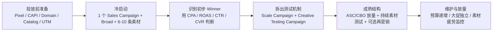

# Meta Ads Account Structure Playbook 2026

一个关于 Meta Ads 电商账户结构的经验作品集项目：从零冷启动，到形成可持续放量的广告结构。

## 项目结论

如果只用一句话概括当前 Meta Ads 的账户结构方向，我会这样说：

> 最好的结构，不是把账户拆得足够细，而是让算法拿到足够集中的信号、足够多样的素材，以及足够清晰的业务目标。

这也是 2026 年 Meta Ads 结构变化里最重要的一点。过去很多投手习惯用兴趣、Lookalike、再营销层级去搭一套复杂漏斗；但现在，更稳的做法往往是简化 campaign 和 ad set，把预算集中到少数功能明确的 campaign 里，再用素材角度和转化信号去驱动系统找人。

对独立站和 Shopify 电商来说，成熟账户通常不需要十几个 campaign。更健康的结构通常是：

| 模块 | 作用 | 常见预算占比 |
|---|---|---:|
| 主力放量 Campaign | 承接已验证素材，追求 Purchase、ROAS、CPA 稳定 | 50%-70% |
| 素材测试 Campaign | 持续验证新角度、新达人、新视频、新图片 | 20%-30% |
| 再营销 Campaign | 承接高意向人群，适合流量充足或高客单账户 | 0%-10% |
| 大促 Campaign | 黑五、圣诞、清仓、上新等节点，不干扰 evergreen 结构 | 单独预算 |

小预算账户不应该一开始就搭满这四层。预算越小，结构越要简单。

## 为什么做这个项目

很多 Meta Ads 账户不是输在某一个按钮没点对，而是输在结构本身没有给算法创造学习条件。

我在整理这个方法论时，重点关注三个问题：

1. 新账户应该怎么冷启动，才不会一开始就把预算打散？
2. 当素材开始出单后，怎么从单一测试 campaign 过渡到稳定放量结构？
3. 成熟账户怎么持续测试新素材，而不是靠几条老素材撑到疲劳？

这个项目试图把这些问题沉淀成一套可复用的工作流，而不是一份“最佳设置清单”。

## 推荐阅读顺序

1. [完整方法论](docs/methodology.md)
2. [冷启动检查清单](templates/cold-start-checklist.md)
3. [账户结构画布](templates/account-structure-canvas.md)
4. [素材测试记录模板](templates/creative-testing-tracker.csv)
5. [参考来源](docs/sources.md)

## 冷启动到成熟结构

## 适用场景

- DTC 独立站
- Shopify 电商
- 跨境电商品牌
- 以 Purchase、ROAS、CPA、GMV 为核心目标的 Meta Ads 账户
- 需要从 0 到 1 冷启动，或从混乱账户结构迁移到稳定结构的投放场景

## 不适用或需调整的场景

- Lead Gen、本地服务、App 下载等非电商目标
- 极高客单价且转化周期很长的产品
- 合规限制较强的行业，如金融、医疗、成人、政治等
- Pixel/CAPI 数据严重缺失，且无法修复的账户

这些场景仍可以借鉴“结构简化、信号集中、素材多样化”的原则，但不能直接套用电商预算比例。

## 核心判断标准

| 问题 | 判断方式 |
|---|---|
| 要不要拆 campaign？ | 只有当产品、国家、语言、offer、毛利或投放目标明显不同，并且预算足够时才拆 |
| 要不要开再营销？ | 有足够站点访问、ATC、IC 或高客单决策周期时再开 |
| 素材是否可以迁移到放量 campaign？ | CPA、ROAS 或 Purchase 稳定优于账户基准，且不是只靠少量偶然转化 |
| 是否需要降预算？ | 连续 3-5 天 CPA 明显高于目标，且不是归因延迟或短期波动 |
| 是否是素材疲劳？ | Frequency 上升、CTR 下降、CPA 上升，并且没有新的受众口袋被打开 |

## 项目价值

这份作品集展示的不只是“我知道 Meta Ads 怎么建 campaign”，而是：

- 能把官方建议翻译成实际账户结构；
- 能区分冷启动、增长期、成熟期的不同动作；
- 能围绕 GMV、ROAS、CPA 和素材生命周期搭建投放系统；
- 能把经验沉淀成模板、检查清单和可执行 SOP。

## 更新时间

2026-06-24

